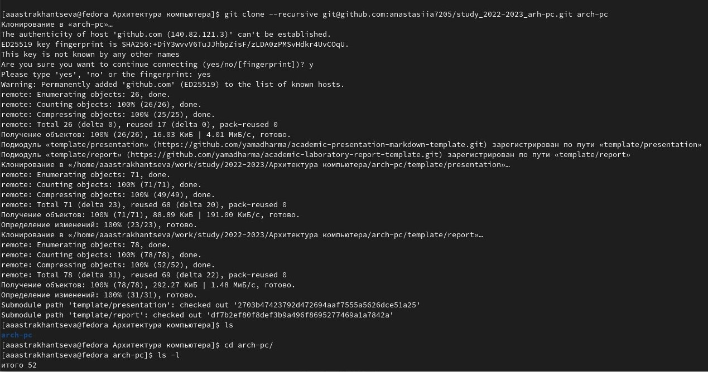

---
## Front matter
title: "Отчет по лабораторной работе №3"
subtitle: "Дисциплина: архитектура компьютера"
author: "Астраханцева Анастасия Александровна"

## Generic otions
lang: ru-RU
toc-title: "Содержание"

## Bibliography
bibliography: bib/cite.bib
csl: pandoc/csl/gost-r-7-0-5-2008-numeric.csl

## Pdf output format
toc: true # Table of contents
toc-depth: 2
lof: true # List of figures

fontsize: 12pt
linestretch: 1.5
papersize: a4
documentclass: scrreprt
## I18n polyglossia
polyglossia-lang:
  name: russian
  options:
	- spelling=modern
	- babelshorthands=true
polyglossia-otherlangs:
  name: english
## I18n babel
babel-lang: russian
babel-otherlangs: english
## Fonts
mainfont: PT Serif
romanfont: PT Serif
sansfont: PT Sans
monofont: PT Mono
mainfontoptions: Ligatures=TeX
romanfontoptions: Ligatures=TeX
sansfontoptions: Ligatures=TeX,Scale=MatchLowercase
monofontoptions: Scale=MatchLowercase,Scale=0.9
## Biblatex
biblatex: true
biblio-style: "gost-numeric"
biblatexoptions:
  - parentracker=true
  - backend=biber
  - hyperref=auto
  - language=auto
  - autolang=other*
  - citestyle=gost-numeric
## Pandoc-crossref LaTeX customization
figureTitle: "Рис."
tableTitle: "Таблица"
listingTitle: "Листинг"
lofTitle: "Список иллюстраций"
lofTitle: "Список иллюстраций"
lolTitle: "Листинги"
## Misc options
indent: true
header-includes:
  - \usepackage{indentfirst}
  - \usepackage{float} # keep figures where there are in the text
  - \floatplacement{figure}{H} # keep figures where there are in the text
---

# Цель работы

Целью работы является изучение идеологии средств контроля версий и ее применение,
а также приобретение практических навыков по работе с системой git. Создание
рабочего пространства, выгрузка отчетов по лабораторным.

# Выполнение лабораторной работы

**Настройка GitHub.**

Создаю учётную запись на сайте https://github.com/ и заполняю основные данные. Сначала сделаю предварительную конфигурацию git. Открою терминал и введу следующие команды, указав свои имя и email. Настрою utf-8 в выводе сообщений git. Задам имя начальной ветки (она будет называться master), параметры autocrlf и safecrlf. (рис. [-@fig:001])

{ #fig:001 width=70% }

**Создание SSH ключа**

Для последующей идентификации пользователя на сервере репозиториев необходимо
сгенерировать пару ключей (приватный и открытый). Ключи сохраняться в каталоге ~/.ssh/. (рис. [-@fig:002]):

{ #fig:002 width=70% }

Загружаю сгенерённый открытый ключ. Для этого на сайте http://github.org/ перехожу
в меню Setting. После этого выбираю в боковом меню SSH and GPG keys. Скопировав
(чтобы скопировать ключ мне нужно было для начала установить пакет, который
предоставляет команду “xclip”) из локальной консоли ключ в буфер обмена вставляю
ключ в появившееся на сайте поле и указываю для ключа имя (Title) (рис. [-@fig:003]):

{ #fig:003 width=70% }

**Создание рабочего пространства и репозитория курса на основе шаблона**

С помощью терминала создаю каталог для предмета «Архитектура компьютера» (рис. [-@fig:004]):

{ #fig:004 width=70% }

**Создание репозитория курса на основе шаблона**

Репозиторий на основе шаблона можно создать через web-интерфейс github. Перехожу
на станицу репозитория с шаблоном курса, выбираю «Use this template.»(рис. [-@fig:005]):

{ #fig:005 width=70% }

Ввожу имя репозитория и создаю его ((рис. [-@fig:006])

{ #fig:006 width=70% }

Клонирую созданный репозиторий. Ссылку для клонирования можно скопировать на
странице созданного репозитория Code -> SSH (рис. [-@fig:007]).

{ #fig:007 width=70% }

**Настройка каталога курса**

Перейду в каталог курса, удалю лишний файл (package.json), создам каталог «COURSE» (рис. [-@fig:008])

{ #fig:008 width=70% }

Отправлю файлы на сервер.рис. (рис. [-@fig:009] -  [-@fig:010]) 

{ #fig:009 width=70% }

{ #fig:010 width=70% }

Проверяю правильность создания иерархии рабочего пространства в локальном репозитории и на странице GitHub (рис. [-@fig:011] - [-@fig:012]): 

{ #fig:011 width=70% }

{ #fig:012 width=70% }

**Задание для самостоятельной работы.**

Для начала переношу отчеты по первой и второй лабораторной работе в
соответствующие папки с помощью команды «mv» (lab1>report и lab2 >report, отчет
по третьей лабораторной загружу после окончания выполнения) (рис. [-@fig:013])

{ #fig:013 width=70% }

Отправляю файлы на сервер (рис. [-@fig:014])

{ #fig:014 width=70% }

# Выводы

Я изучила идеологию средств контроля версий и ее применение, а также
приобрела практические навыки по работе с системой git. Так же создала рабочее
пространство на сайте GitHub с помощью терминала.

