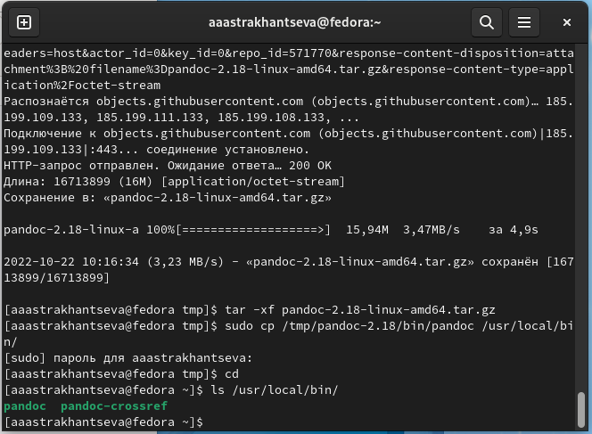

---
## Front matter
title: "Отчет по лабораторной работе №4"
subtitle: "Дисциплина: архитектура компьютера"
author: "Астраханцева Анастасия Александровна"

## Generic otions
lang: ru-RU
toc-title: "Содержание"

## Bibliography
bibliography: bib/cite.bib
csl: pandoc/csl/gost-r-7-0-5-2008-numeric.csl

## Pdf output format
toc: true # Table of contents
toc-depth: 2
lof: true # List of figures
fontsize: 12pt
linestretch: 1.5
papersize: a4
documentclass: scrreprt
## I18n polyglossia
polyglossia-lang:
  name: russian
  options:
	- spelling=modern
	- babelshorthands=true
polyglossia-otherlangs:
  name: english
## I18n babel
babel-lang: russian
babel-otherlangs: english
## Fonts
mainfont: PT Serif
romanfont: PT Serif
sansfont: PT Sans
monofont: PT Mono
mainfontoptions: Ligatures=TeX
romanfontoptions: Ligatures=TeX
sansfontoptions: Ligatures=TeX,Scale=MatchLowercase
monofontoptions: Scale=MatchLowercase,Scale=0.9
## Biblatex
biblatex: true
biblio-style: "gost-numeric"
biblatexoptions:
  - parentracker=true
  - backend=biber
  - hyperref=auto
  - language=auto
  - autolang=other*
  - citestyle=gost-numeric
## Pandoc-crossref LaTeX customization
figureTitle: "Рис."
tableTitle: "Таблица"
listingTitle: "Листинг"
lofTitle: "Список иллюстраций"
lotTitle: "Список таблиц"
lolTitle: "Листинги"
## Misc options
indent: true
header-includes:
  - \usepackage{indentfirst}
  - \usepackage{float} # keep figures where there are in the text
  - \floatplacement{figure}{H} # keep figures where there are in the text
---

# Цель работы

Целью работы является знакомство с основными процедурами оформления отчетов с помощью легковесного языка Markdown, а так же его освоение. 

# Задание

Установить необходимое ПО на ПК, а именно Tex Live, Pandoc и pandoc-crossref.
Далее необходимо познакомиться с языком Markdown и оформить с его помощью отчет по лабораторной работе.

# Выполнение лабораторной работы
Для начала необходимо установить необходимое ПО. Для установки TexLive скачаю архив: у меня не получалось установить его через терминал, поэтому я устанавливала его через сайт. (рис. [-@fig:001])

{ #fig:001 width=70% }

Далее распаковываю архив, перехожу в распакованную паку, и запускаю скрипт install-tl c root правами: (рис. [-@fig:002])

{ #fig:002 width=70% }

Добавляю /usr/local/texlive/2022/bin/x86_64-linux в свой PATH для текущей и будущих сессий.(рис. [-@fig:003])

{ #fig:003 width=70% }

Далее необходимо установить Pandoc и pandoc-crossref. Скачиваю архив pandoc.2.19, pandoc-crossref.v.0.3.13.0 (на самом деле нужно смотреть на соотвестствие версий pandoс и pandoc-crossref. Я по ошибке сначала загрузила версию pandoc.2.19, но попотм установила 2.18) (рис. [-@fig:004] - [-@fig:006])

{ #fig:004 width=70% }

{ #fig:005 width=70% }

{ #fig:006 width=70% }

Распаковываю архивы pandoc.2.19, pandoc-crossref.v.0.3.13.0 (далее распаковка архива pandoc.2.18) рис. [-@fig:007])

{ #fig:007 width=70% }

Выполняю копирование файлов pandoc и pandoc-crossref в каталог /usr/local/bin/ (рис. [-@fig:008] - [-@fig:009]): 

{ #fig:008 width=70% }

{ #fig:009 width=70% }

Выполняю проверку с помощью команды ls (рис. [-@fig:010]):

{ #fig:010 width=70% }

Начинаю выполнение основоного задания лаборатоной работы, перехожу в каталог курса, сфомированный при выполненнии лабораторной работы №3. Обновляю локальный репозиторий, скачав изменения из удаленного репози-
тория с помощью команды "git pull", перехожу в каталог с шаблоном отчета по лабораторной работе №4.Провожу компиляцию шаблона с использованием Makefile (с помощью команды "make"). Используя команду "ls", проверю, произошла ли генерация файлов report.pdf и report.docx. Далее удаляю полученный файлы с использованием Makefile (ввожу команду "make clean"). Проверяю правильность выполнения команды. (рис. [-@fig:011])

{ #fig:011 width=70% }

Открою файл report.md c помощью gedit (рис. [-@fig:012])

{ #fig:012 width=70% }

Далее я начала выполнять отчет по лабораторной №3. (рис. [-@fig:013])

{ #fig:013 width=70% }

Далее загружаю файлы на GitHub (рис. [-@fig:014]):

{ #fig:014 width=70% }

# Выводы

Я познакомилась с основными процедурами оформления отчетов с помощью легковесного языка Markdown, а так же офомила с его помощью отчет по лабораторным раюотам №3 и №4.

