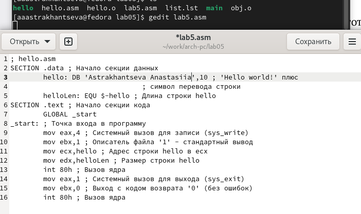

---
## Front matter
title: "Отчет по лабораторной работе №5"
subtitle: "Дисциплина: архитектура компьютера"
author: "Астраханцева Анастасия Александровна"

## Generic otions
lang: ru-RU
toc-title: "Содержание"

## Bibliography
bibliography: bib/cite.bib
csl: pandoc/csl/gost-r-7-0-5-2008-numeric.csl

## Pdf output format
toc: true # Table of contents
toc-depth: 2
lof: true # List of figures
fontsize: 12pt
linestretch: 1.5
papersize: a4
documentclass: scrreprt
## I18n polyglossia
polyglossia-lang:
  name: russian
  options:
	- spelling=modern
	- babelshorthands=true
polyglossia-otherlangs:
  name: english
## I18n babel
babel-lang: russian
babel-otherlangs: english
## Fonts
mainfont: PT Serif
romanfont: PT Serif
sansfont: PT Sans
monofont: PT Mono
mainfontoptions: Ligatures=TeX
romanfontoptions: Ligatures=TeX
sansfontoptions: Ligatures=TeX,Scale=MatchLowercase
monofontoptions: Scale=MatchLowercase,Scale=0.9
## Biblatex
biblatex: true
biblio-style: "gost-numeric"
biblatexoptions:
  - parentracker=true
  - backend=biber
  - hyperref=auto
  - language=auto
  - autolang=other*
  - citestyle=gost-numeric
## Pandoc-crossref LaTeX customization
figureTitle: "Рис."
listingTitle: "Листинг"
lofTitle: "Список иллюстраций"
lotTitle: "Список таблиц"
lolTitle: "Листинги"
## Misc options
indent: true
header-includes:
  - \usepackage{indentfirst}
  - \usepackage{float} # keep figures where there are in the text
  - \floatplacement{figure}{H} # keep figures where there are in the text
---

# Цель работы

Знакомство с ассемблером. Освоение процедуры компиляции и сборки программ, написанных на ассемблере NASM.

# Задание

Знакоство с машинно-оринтированным языком низкого уровня - ассемблером, написание первой  программы "Hello world!"

# Выполнение лабораторной работы

**Программа Hello world!**

Для начала создам папку lab05 в ~/work/study/2022-2023/"Архитектура комптютера"/arch-pc/labs/lab05. После этого перейду в эту папку. Далее создам текстовый файл hello.asm и открою его с помощью gedit(рис. [-@fig:001]):

{ #fig:001 width=70% }

После открытия ввожу в это файл текст программы (рис. [-@fig:002]):

{ #fig:002 width=70% }

**Транслятор NASM**

NASM превращает текст программы в объектный код. Для компилции программы «Hello World» необходимо написать такую команду (рис. [-@fig:003]):

{ #fig:003 width=70% }

Транслятор преобразует текст программы из файла hello.asm в объектный код, который запишется в файл hello.o. NASM не запускают без параметров, ключ -f указывает транслятору, что требуется создать бинарные файлы в формате ELF. Формат elf64 позволяет создавать исполняемый код, работающий под 64-битными версиями Linux. 
NASM всегда создаёт выходные файлы в текущем каталоге.

**Компоновщик LD**

Передаю объектный файл компановщику (рис. [-@fig:004]). После этого запускаю на выполнение созданный исполняемый файл:

{ #fig:004 width=70% }

**Задания для самостоятельной работы**

Файл hello.asm я перенесла из ~/work/study/2022-2023/"Архитектура комптютера" ~/arch-pc/labs/lab05 в  ~/work/arch-pc/lab05. После этого я создала копию этого файла с именем lab5.asm (рис. [-@fig:005]):

{ #fig:005 width=70% }

С помощью gedit вношу изменения в написанную програму, чтобы она выводила мое имя и фамилию  (рис. [-@fig:006]):

{ #fig:006 width=70% }

Далее нужно оттранслировать полученный текст программы lab5.asm в объектный
файл. После этого запускаю получившйся файл (рис. [-@fig:007]):

{ #fig:007 width=70% }

Далее копирую получившиеся файлы из папки ~/arch-pc/labs/lab05 в ~/work/study/2022-2023/"Архитектура комптютера"/arch-pc/labs/lab05 с помощбю команды cp (рис. [-@fig:008]):

{ #fig:008 width=70% }

После этого зашружаю файлы на GitHub (рис. [-@fig:009]):

{ #fig:009 width=70% }

# Выводы

Я познокомилась с языком ассемблер, освоила процедуры компиляции и сборки программ, написанных на ассемблере NASM.
