---
## Front matter
title: "Отчет по лабораторной работе №6"
subtitle: "Дисциплина: архитектура компьютера"
author: "Астраханцева Анастасия Александровна"

## Generic otions
lang: ru-RU
toc-title: "Содержание"

## Bibliography
bibliography: bib/cite.bib
csl: pandoc/csl/gost-r-7-0-5-2008-numeric.csl

## Pdf output format
toc: true # Table of contents
toc-depth: 2
lof: true # List of figures
lot: true # List of tables
fontsize: 12pt
linestretch: 1.5
papersize: a4
documentclass: scrreprt
## I18n polyglossia
polyglossia-lang:
  name: russian
  options:
	- spelling=modern
	- babelshorthands=true
polyglossia-otherlangs:
  name: english
## I18n babel
babel-lang: russian
babel-otherlangs: english
## Fonts
mainfont: PT Serif
romanfont: PT Serif
sansfont: PT Sans
monofont: PT Mono
mainfontoptions: Ligatures=TeX
romanfontoptions: Ligatures=TeX
sansfontoptions: Ligatures=TeX,Scale=MatchLowercase
monofontoptions: Scale=MatchLowercase,Scale=0.9
## Biblatex
biblatex: true
biblio-style: "gost-numeric"
biblatexoptions:
  - parentracker=true
  - backend=biber
  - hyperref=auto
  - language=auto
  - autolang=other*
  - citestyle=gost-numeric
## Pandoc-crossref LaTeX customization
figureTitle: "Рис."
tableTitle: "Таблица"
listingTitle: "Листинг"
lofTitle: "Список иллюстраций"
lotTitle: "Список таблиц"
lolTitle: "Листинги"
## Misc options
indent: true
header-includes:
  - \usepackage{indentfirst}
  - \usepackage{float} # keep figures where there are in the text
  - \floatplacement{figure}{H} # keep figures where there are in the text
---

# Цель работы

Приобретение практических навыков работы в Midnight Commander. Освоение инструкций языка ассемблера mov и int.

# Выполнение лабораторной работы


Для начала открою Midnight Commander с помощью команды mc(рис. [-@fig:001]):


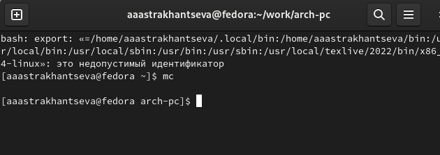{ #fig:001 width=70% }


Далее с помощью клавиши `F7` создаю папку lab06 и перехожу в нее (рис. [-@fig:002]):


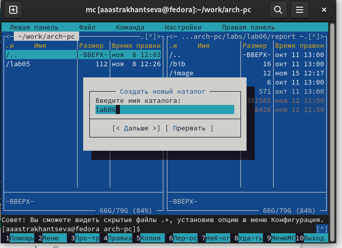{ #fig:002 width=70% }


После этого, пользуясь строкой ввода и командой touch создаю файл lab06-1.asm  (рис. [-@fig:003]):


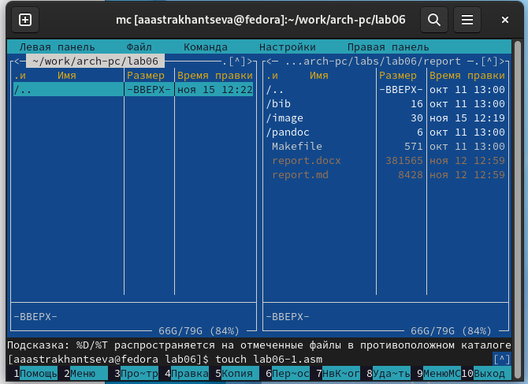{ #fig:003 width=70% }


Далее с помощью клавиши `F4` открываю созданный файл для редактирование во встроенном редакторе, записываю текст программы, сохраняю его (рис. [-@fig:004]):


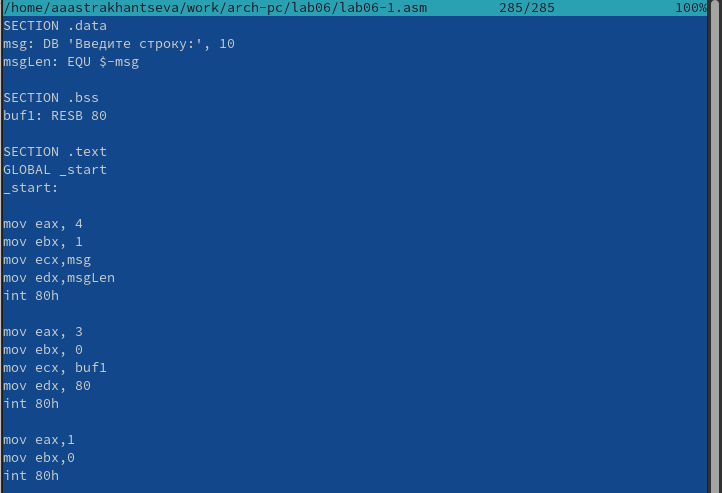{ #fig:004 width=70% }


Код программы 1:

```nasm
;------------------------------------------------------------------
; Программа вывода сообщения на экран и ввода строки с клавиатуры
;------------------------------------------------------------------
;------------------- Объявление переменных ----------------
SECTION .data ; Секция инициированных данных
msg: DB 'Введите строку:',10 ; сообщение плюс
; символ перевода строки
msgLen: EQU $-msg ; Длина переменной 'msg'
SECTION .bss ; Секция не инициированных данных
buf1: RESB 80 ; Буфер размером 80 байт
;------------------- Текст программы -----------------
SECTION .text ; Код программы
GLOBAL _start ; Начало программы
_start: ; Точка входа в программу
;------------ Cистемный вызов `write`
; После вызова инструкции 'int 80h' на экран будет
; выведено сообщение из переменной 'msg' длиной 'msgLen'
mov eax,4 ; Системный вызов для записи (sys_write)
mov ebx,1 ; Описатель файла 1 - стандартный вывод
mov ecx,msg ; Адрес строки 'msg' в 'ecx'
mov edx,msgLen ; Размер строки 'msg' в 'edx'
int 80h ; Вызов ядра
;------------ системный вызов `read` ----------------------
; После вызова инструкции 'int 80h' программа будет ожидать ввода
; строки, которая будет записана в переменную 'buf1' размером 80
байт↪
mov eax, 3 ; Системный вызов для чтения (sys_read)
mov ebx, 0 ; Дескриптор файла 0 - стандартный ввод
mov ecx, buf1 ; Адрес буфера под вводимую строку
mov edx, 80 ; Длина вводимой строки
int 80h ; Вызов ядра
```

После этого нужно создать объектный файл lab06-1.о. Выполняю компоновку объектного файла и запускаю получившийся исполняемый файл с помощью команд (рис. [-@fig:005]):


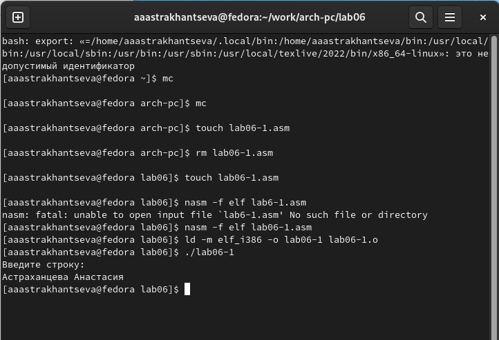{ #fig:005 width=70% }


## Подключение внешнего файла in_out.asm


Для упрощения написания программ часто встречающиеся одинаковые участки кода (такие как, например, вывод строки на экран или выход их программы) можно оформить в виде подпрограмм и сохранить в отдельные файлы, а во всех нужных местах поставить вызов нужной подпрограммы. Это позволяет сделать основную программу более удобной для написания и чтения.

Далее необходим скачать файл in_out.asm со страницы курса в ТУИС. Подключаемый файл in_out.asm должен лежать в том же каталоге, что и файл с программой, в которой он используется, поэтому с помощью клавиши `F5` я копирую скачанный файл в папку lab06 (рис. [-@fig:006]):


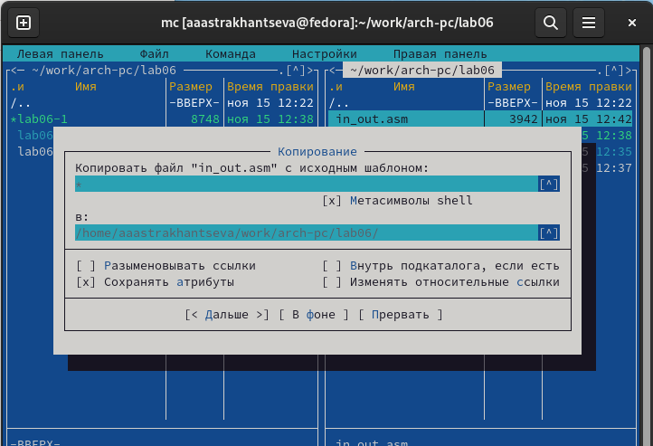{ #fig:006 width=70% }


С помощью клавиши `F6` создаю копию файла lab06-1 с именем  lab06-2 (рис. [-@fig:007]):


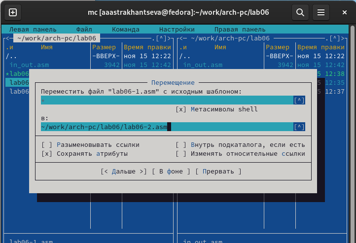{ #fig:007 width=70% }


После этого я исправляю текст программы в файле lab06-2(рис. [-@fig:008]):


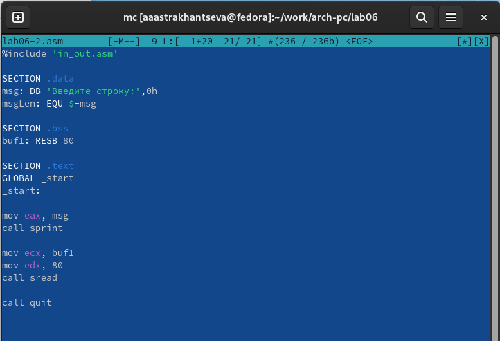{ #fig:008 width=70% }


Код программы 2:
```nasm
;--------------------------------------------------------------------
; Программа вывода сообщения на экран и ввода строки с клавиатуры
;---------------------------------------------------------------------
%include 'in_out.asm' ; подключение внешнего файла
SECTION .data ; Секция инициированных данных
msg: DB 'Введите строку: ',0h ; сообщение
SECTION .bss ; Секция не инициированных данных
buf1: RESB 80 ; Буфер размером 80 байт
SECTION .text ; Код программы
GLOBAL _start ; Начало программы
_start: ; Точка входа в программу
mov eax, msg ; запись адреса выводимого сообщения в `EAX`
call sprintLF ; вызов подпрограммы печати сообщения
mov ecx, buf1 ; запись адреса переменной в `EAX`
mov edx, 80 ; запись длины вводимого сообщения в `EBX`
call sread ; вызов подпрограммы ввода сообщения
call quit ; вызов подпрограммы завершения
```

После этого нужно оттранслировать текст программы lab06-2.asm в объектный файл. Выполняю компоновку объектного файла и запускаю получившийся исполняемый файл с помощью команд: (рис. [-@fig:009]):


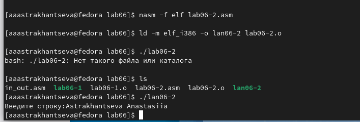{ #fig:009 width=70% }


## Задания для самостоятельной работы


Для начала создаю копию файла lab06-1.asm с именем lab06-1-1.asm (рис. [-@fig:010]):


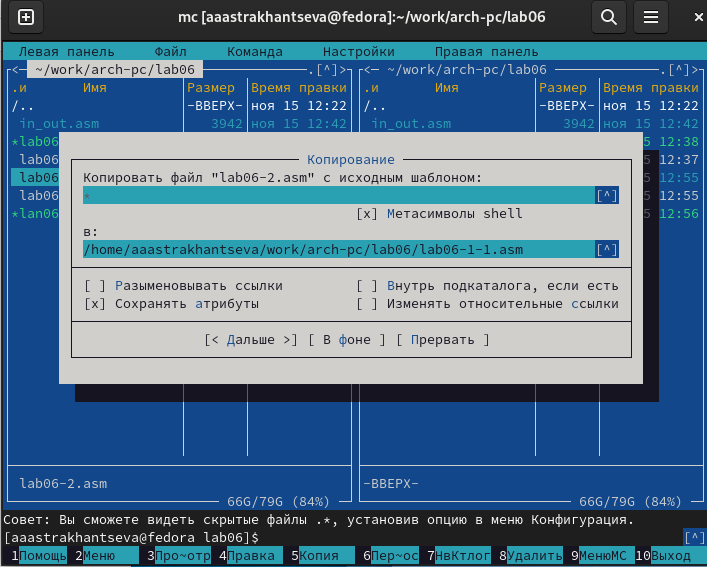{ #fig:010 width=70% }


После этого вношу изменения в программу (рис. [-@fig:011]):


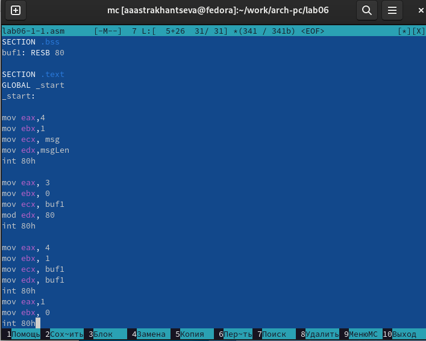{ #fig:011 width=70% }


Код программы 3: 


```nasm
SECTION .data ; Секция инициированных данных
msg: DB 'Введите строку:',10
msgLen: EQU $-msg ; Длина переменной 'msg'
SECTION .bss ; Секция не инициированных данных
buf1: RESB 80 ; Буфер размером 80 байт
SECTION .text ; Код программы
GLOBAL _start ; Начало программы
_start: ; Точка входа в программу
mov eax,4 ; Системный вызов для записи (sys_write)
mov ebx,1 ; Описатель файла 1 - стандартный вывод
mov ecx,msg ; Адрес строки 'msg' в 'ecx'
mov edx,msgLen ; Размер строки 'msg' в 'edx'
int 80h ; Вызов ядра
mov eax, 3 ; Системный вызов для чтения (sys_read)
mov ebx, 0 ; Дескриптор файла 0 - стандартный ввод
mov ecx, buf1 ; Адрес буфера под вводимую строку
mov edx, 80 ; Длина вводимой строки
int 80h ; Вызов ядра
mov eax,4 ; Системный вызов для записи (sys_write)
mov ebx,1 ; Описатель файла '1' - стандартный вывод
mov ecx,buf1 ; Адрес строки buf1 в ecx
mov edx,buf1 ; Размер строки buf1
int 80h ; Вызов ядра
mov eax,1 ; Системный вызов для выхода (sys_exit)
mov ebx,0 ; Выход с кодом возврата 0 (без ошибок)
int 80h ; Вызов ядра
```


После этого нужно создать объектный файл lab06-1-1.о. Выполняю компоновку объектного файла и запускаю получившийся исполняемый файл с помощью команд (рис. [-@fig:012]):


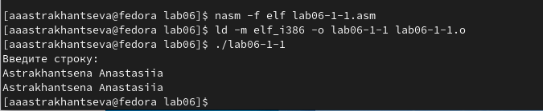{ #fig:012 width=70% }


Далее копирую файл lab06-2.asm c именем lab06-2-1.asm (рис. [-@fig:013]):


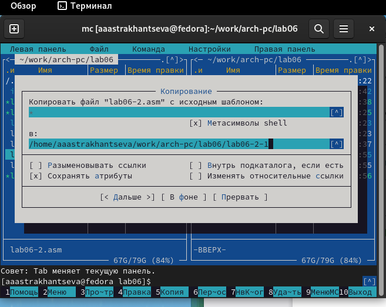{ #fig:013 width=70% }


Вношу изменения в программу, чтобы она выводила сторчку на экран (рис. [-@fig:014]):


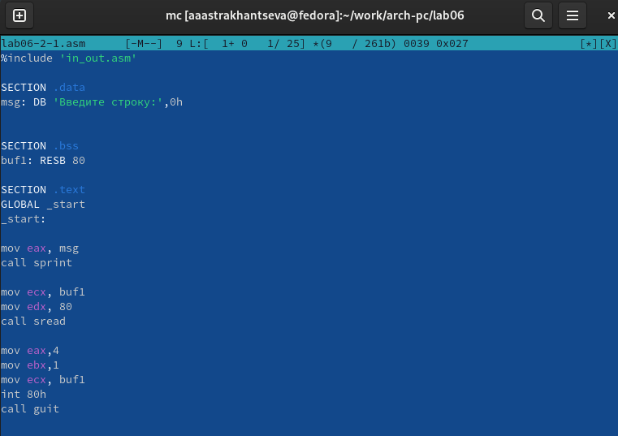{ #fig:014 width=70% }


Код программы 4:


```nasm 
%include 'in_out.asm'
SECTION .data ; Секция инициированных данных
msg: DB 'Введите строку: ',0h ; сообщение
SECTION .bss ; Секция не инициированных данных
buf1: RESB 80 ; Буфер размером 80 байт
SECTION .text ; Код программы
GLOBAL _start ; Начало программы
_start: ; Точка входа в программу
mov eax, msg ; запись адреса выводимого сообщения в `EAX`
call sprint ; вызов подпрограммы печати сообщения
mov ecx, buf1 ; запись адреса переменной в `EAX`
mov edx, 80 ; запись длины вводимого сообщения в `EBX`
call sread ; вызов подпрограммы ввода сообщения
mov eax,4 ; Системный вызов для записи (sys_write)
mov ebx,1 ; Описатель файла '1' - стандартный вывод
mov ecx,buf1 ; Адрес строки buf1 в ecx
int 80h ; Вызов ядра
call quit ; вызов подпрограммы завершения
```

После этого нужно создать объектный файл lab06-2-1.о. Выполняю компоновку объектного файла и запускаю получившийся исполняемый файл с помощью команд (рис. [-@fig:015]):


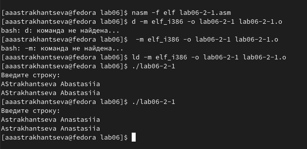{ #fig:015 width=70% }

# Выводы

Я приобрела практические навыки работы в Midnight Commander и освоила инструкции языка ассемблера mov и int.


